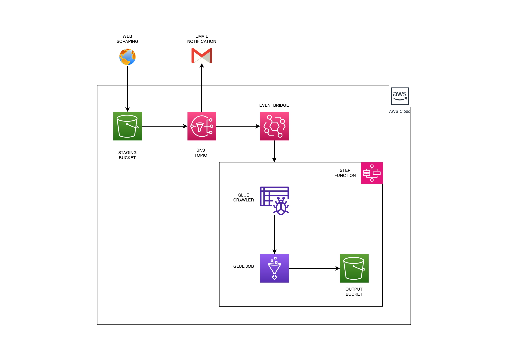
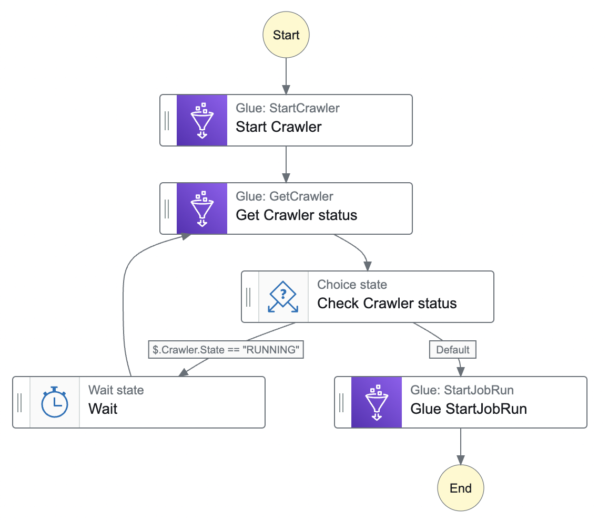

# ETL Pipeline with AWS Services

## Overview

This project demonstrates how to use AWS Services to automate the ETL (Extract, Transform, Load) process for web-scraped data. The data for this project is sourced from [Lamudi Scraper](https://github.com/njolnir/Lamudi_Scraper).

## Architecture

The ETL pipeline leverages the following AWS services:

- **S3**: Storage for raw and processed data.
- **SNS Topic**: Notification service for triggering events.
- **EventBridge**: Event-driven service to route events.
- **Step Functions**: Orchestrates the workflow of the ETL process.
- **Glue Crawlers**: Catalogs the data stored in S3.
- **Glue Job**: Performs the transformation of the data.

## Workflow Diagram

## Workflow

1. **Data Upload to S3**: Data is uploaded to an S3 bucket.
2. **Email Notification**: An SNS Topic sends an email notification when a CSV file is uploaded to S3.
3. **Event Trigger**: An S3 Object Created event triggers EventBridge.
4. **Step Functions Execution**: EventBridge invokes a Step Function state machine.
5. **Crawler Execution**: The Step Function starts a Glue Crawler to catalog the new data.
6. **ETL Job Execution**: Once the crawler completes, the Step Function starts a Glue Job to process and transform the data. 

### Step Function Worflow
### Diagram

### Orchestration

The Step Function orchestrates the ETL process as follows:

1. **Start Crawler**: Begins the Glue Crawler to catalog new data in S3.
2. **Get Crawler Status**: Retrieves the current status of the Glue Crawler.
3. **Check Crawler Status**: Checks if the crawler is still running.
   - If the crawler is running, the state machine waits for 30 seconds and then rechecks the crawler status.
   - If the crawler is not running, the state machine proceeds to start the Glue Job.
4. **Glue Start Job Run**: Starts the Glue Job to process and transform the data.

For more details on the web scraping source, visit [Lamudi Scraper GitHub Repository](https://github.com/njolnir/Lamudi_Scraper).

